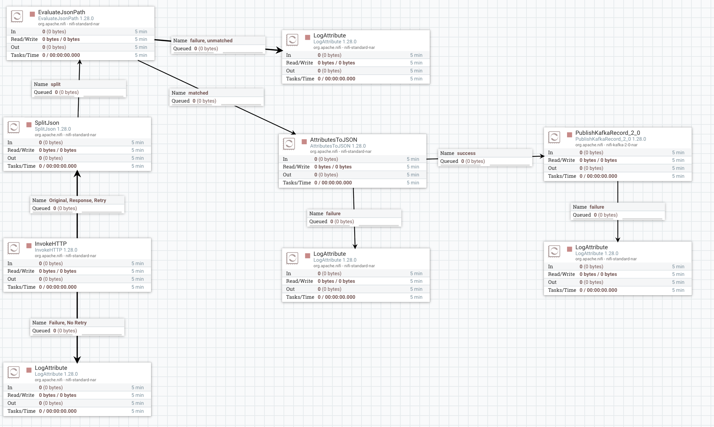

# 🛫 Pipeline Big Data Aéronautique — Traitement Temps Réel

[](https://www.docker.com/)
[](https://spark.apache.org/)
[](https://kafka.apache.org/)
[](https://www.postgresql.org/)

---

## 📋 Table des matières

- [Vue d'ensemble](#-vue-densemble)
- [Architecture](#-architecture-technique)
- [Stack technologique](#-stack-technologique)
- [Prérequis](#-prérequis)
- [Installation et démarrage](#-installation-et-démarrage)
- [Pipeline détaillé](#-pipeline-détaillé)
- [Visualisation Grafana](#-visualisation-grafana)
- [Débogage](#-débogage--astuces)
- [Améliorations futures](#-améliorations-futures)
- [Ressources](#-ressources-utiles)
- [Contributeurs](#-contributeurs)

---

## 🎯 Vue d'ensemble

Ce projet implémente un **pipeline de traitement distribué de données aéronautiques en temps réel** utilisant les technologies Big Data les plus performantes du marché. L'objectif est de démontrer la maîtrise complète d'une chaîne de traitement moderne, de l'ingestion à la visualisation.

### 🔄 Flux de données

```
API Aéronautique → NiFi → Kafka → Spark Streaming → PostgreSQL → Grafana
     (source)    (ETL)  (broker) (transformation)  (stockage)  (viz)
```

### 🎓 Objectifs pédagogiques

- ✅ Maîtriser l'orchestration de flux avec **Apache NiFi**
- ✅ Comprendre le fonctionnement d'un **message broker** (Kafka)
- ✅ Traiter des streams en temps réel avec **Spark Structured Streaming**
- ✅ Persister des données dans une base **PostgreSQL**
- ✅ Créer des dashboards interactifs avec **Grafana**
- ✅ Orchestrer une architecture microservices avec **Docker Compose**

---

## 🏗️ Architecture technique

```
┌─────────────────────────────────────────────────────────────────────────┐
│                         PIPELINE BIG DATA                               │
└─────────────────────────────────────────────────────────────────────────┘

┌──────────────┐      ┌─────────────┐      ┌──────────────┐
│   API Ext.   │─────▶│    NiFi     │─────▶│    Kafka     │
│ AviationStack│      │ :8443       │      │ :9092/:9093  │
│   OpenAIP    │      │             │      │              │
└──────────────┘      └─────────────┘      └──────┬───────┘
                                                   │
                      ┌────────────────────────────┘
                      │
                      ▼
              ┌───────────────┐       ┌──────────────┐
              │ Spark Cluster │──────▶│  PostgreSQL  │
              │ Master :8080  │       │    :5432     │
              │ Worker :8081  │       │              │
              └───────────────┘       └──────┬───────┘
                                             │
                      ┌──────────────────────┴────────┐
                      │                               │
                      ▼                               ▼
              ┌───────────────┐             ┌─────────────┐
              │    pgAdmin    │             │   Grafana   │
              │     :5050     │             │    :3000    │
              └───────────────┘             └─────────────┘
```

---

## 🧩 Stack technologique

| Composant | Technologie | Version | Rôle |
|-----------|-------------|---------|------|
|  | **Apache NiFi** | 1.28.0 | Orchestration et ingestion des flux de données |
|  | **Apache Kafka** | 7.5.0 (Confluent) | Message broker distribué pour streaming |
|  | **Apache ZooKeeper** | 7.5.0 | Coordination et gestion de l'état Kafka |
|  | **Apache Spark** | 3.5.0 | Traitement distribué en temps réel |
|  | **PostgreSQL** | 15 | Base de données relationnelle |
| 🛠️ | **pgAdmin** | Latest | Interface web d'administration PostgreSQL |
|  | **Grafana** | Enterprise (latest) | Dashboards et visualisation temps réel |
|  | **Docker Compose** | - | Orchestration de l'infrastructure |

---

## 📦 Prérequis

### Ports à libérer

Assurez-vous que les ports suivants sont disponibles :

| Port | Service | Description |
|------|---------|-------------|
| `2181` | ZooKeeper | Coordination Kafka |
| `9092` | Kafka | Accès externe |
| `9093` | Kafka | Communication inter-services |
| `8443` | NiFi | Interface web (HTTPS) |
| `7077` | Spark Master | Cluster Spark |
| `8080` | Spark Master UI | Interface web |
| `8081` | Spark Worker | Nœud de calcul |
| `5432` | PostgreSQL | Base de données |
| `5050` | pgAdmin | Interface d'administration |
| `3000` | Grafana | Dashboards |

---
# AJOUT THOMAS

---

##  Collecte des données avec Apache NiFi

**🎯 Objectif :** Récupérer et préparer les données issues de différentes API aéronautiques avant leur diffusion vers Kafka.

### Fonctions principales
- Connexion à plusieurs sources d’API.
- Filtrage et enrichissement léger des flux.
- Transformation des données en JSON structuré.
- Envoi vers Kafka pour diffusion en temps réel.

### Chaîne de traitement NiFi
- **InvokeHTTP** → interroge l’API pour récupérer les données brutes.  
- **EvaluateJsonPath** → extrait les champs pertinents du JSON.  
- **AttributesToJSON** → reformate les données extraites en flux JSON.  
- **PublishKafkaRecord** → publie les messages sur un *topic* Kafka.  
- **LogAttribute** → permet le suivi et le débogage du flux.

---

## ⚡ Diffusion en temps réel avec Apache Kafka

** Objectif :** Servir de couche intermédiaire entre NiFi et Spark pour la diffusion des flux de données.

### Fonctionnement
- **Producteurs** : NiFi envoie les données vers Kafka.  
- **Topics** : organisation des flux par type (vols, aéroports, fréquences, etc.).  
- **Consommateurs** : Spark lit les messages pour les transformer en continu.

Kafka assure une **mise en file d’attente fiable** et garantit la **diffusion en temps réel** des données aéronautiques.

---

##  Traitement et intégration avec Apache Spark Structured Streaming

** Objectif :** Nettoyer, transformer et insérer les données dans la base PostgreSQL en temps réel.

Le script **`Streaming-processor.py`** assure le traitement des données issues de Kafka avant leur stockage.

### Étapes principales du pipeline Spark

- **⚙️ Configuration** → Chargement des dépendances pour Kafka et PostgreSQL.  
- **📐 Définition du schéma** → Description de la structure des données d’aéroports.  
- **🔍 Lecture** → Récupère les flux JSON depuis Kafka.  
- **🧩 Transformation** → Nettoie et uniformise les champs importants.  
- **💾 Écriture** → Insère les données transformées dans PostgreSQL.  
- **♻️ Exécution continue** → Laisse tourner le streaming pour un flux en temps réel.

---

## 🗄️ Stockage et gestion avec PostgreSQL + pgAdmin

** Objectif :** Assurer la **persistance** et la **structuration** des données traitées.

### Fonctionnalités
- **PostgreSQL** sert de base de données relationnelle principale.  
- **pgAdmin** permet d’explorer les tables, exécuter des requêtes et valider les données.  

Cette couche garantit une **historisation complète** et un accès simplifié pour les analyses et visualisations ultérieures.

---

## 📊 Visualisation avec Grafana

** Objectif :** Transformer les données stockées en **indicateurs visuels dynamiques**.

### Fonctionnalités principales
- Création de **dashboards interactifs** pour le suivi du trafic aérien.  
- Visualisation de **cartes**, **graphiques**, **statistiques** et **tendances**.  
- Mise en place d’**alertes** et de **KPI** pour la surveillance en temps réel.  
- Connexion directe à PostgreSQL pour un rafraîchissement automatique des données.

Grafana permet une **analyse intuitive** et une **prise de décision rapide**, tout en offrant une vision globale de l’activité aéronautique.

---

## 🧠 Vue d’ensemble du pipeline


---

## 🚀 Installation et démarrage

### 1️⃣ Cloner le projet

```bash
git clone https://github.com/votre-repo/pipeline-big-data-aero.git
cd pipeline-big-data-aero
```

### 2️⃣ Démarrer l'infrastructure

```bash
# Lancer tous les services en arrière-plan
docker compose up -d

# Vérifier l'état des conteneurs
docker compose ps

# Suivre les logs en temps réel
docker compose logs -f
```

### 3️⃣ Vérification du démarrage

Attendez environ **2-3 minutes** que tous les services soient opérationnels, puis vérifiez :

```bash
# Tous les conteneurs doivent être "Up"
docker compose ps

# Kafka doit être prêt
docker exec -it kafka kafka-topics.sh --bootstrap-server localhost:9092 --list
```

### 4️⃣ Accès aux interfaces web

| Interface | URL | Identifiants par défaut |
|-----------|-----|------------------------|
| 🌊 **NiFi** | https://localhost:8443/nifi | Auto-généré (voir logs) |
| 🗄️ **pgAdmin** | http://localhost:5050 | `admin@example.com` / `admin` |
| ⚡ **Spark Master** | http://localhost:8080 | Aucun |
| 📊 **Grafana** | http://localhost:3000 | `admin` / `admin` |

**Note NiFi** : Pour récupérer le mot de passe auto-généré :
```bash
docker logs nifi 2>&1 | grep -i "Generated Username"
```

### 5️⃣ Arrêt de l'infrastructure

```bash
# Arrêter tous les services
docker compose down

# Arrêter ET supprimer les volumes (⚠️ perte de données)
docker compose down -v
```

---

## 🔄 Pipeline détaillé

### 1️⃣ Apache NiFi — Ingestion des données

#### Configuration initiale

1. **Accéder à NiFi** : https://localhost:8443/nifi
2. **Importer le template** : `src/nifi/Template_airport.xml`
   - Clic droit sur le canvas → Upload Template
   - Déposer le fichier XML
3. **Instancier le template** : glisser l'icône de template sur le canvas

#### Architecture du flux NiFi




```
┌─────────────────┐
│  InvokeHTTP     │  ← Interroge l'API externe (GET)
│  (API Call)     │     Config: URL, Headers, API Key
└────────┬────────┘
         │
         ▼
┌─────────────────┐
│   SplitJson     │  ← Découpe le JSON en éléments individuels
│                 │     JsonPath: $.data[*]
└────────┬────────┘
         │
         ▼
┌─────────────────┐
│ EvaluateJsonPath│  ← Extrait les champs importants
│                 │     Ex: $.icao, $.name, $.latitude
└────────┬────────┘
         │
         ▼
┌─────────────────┐
│AttributesToJSON │  ← Reconstruit un JSON normalisé
│                 │     Destination: flowfile-content
└────────┬────────┘
         │
         ▼
┌─────────────────┐
│PublishKafkaRec  │  ← Publie vers Kafka
│    :9093        │     Topic: airportInt / airportnyc
└─────────────────┘     Bootstrap: kafka:9093
```

#### Configuration des processeurs clés

**InvokeHTTP** :
- Remote URL : `https://api.aviationstack.com/v1/flights` (exemple)
- HTTP Method : `GET`
- Request Header : `X-API-Key: VOTRE_CLE_API`

**PublishKafkaRecord_2_0** :
- Kafka Brokers : `kafka:9093`
- Topic Name : `airportInt` (ou `airportnyc`)
- Record Reader : `JsonTreeReader`
- Record Writer : `JsonRecordSetWriter`

#### Démarrage du flux

1. Sélectionner tous les processeurs (Ctrl+A)
2. Clic droit → Start
3. Vérifier dans les queues que les FlowFiles transitent

#### Vérification dans Kafka

```bash
# Lister les topics
docker exec -it kafka kafka-topics.sh \
  --bootstrap-server localhost:9092 --list

# Consommer les messages du topic
docker exec -it kafka kafka-console-consumer.sh \
  --bootstrap-server localhost:9092 \
  --topic airportInt \
  --from-beginning \
  --max-messages 5
```

---

### 2️⃣ Apache Kafka — Message Broker

#### Rôle dans le pipeline

Kafka agit comme un **tampon de messages asynchrone** entre NiFi (producteur) et Spark (consommateur), offrant :

- ✅ **Découplage** : NiFi et Spark peuvent fonctionner à des rythmes différents
- ✅ **Résilience** : Les messages sont persistés sur disque
- ✅ **Scalabilité** : Ajout de partitions et de brokers à la demande
- ✅ **Replay** : Possibilité de rejouer les messages depuis un offset donné

#### Topics utilisés

| Topic | Source | Consommateur | Description |
|-------|--------|--------------|-------------|
| `airportInt` | NiFi (OpenAIP) | Spark (`app.py`) | Données d'aéroports internationaux |
| `airportnyc` | NiFi (AviationStack) | Spark (`appnyc.py`) | Données de vols NYC |

#### Configuration réseau

```yaml
# Accès depuis l'extérieur du réseau Docker
KAFKA_ADVERTISED_LISTENERS: PLAINTEXT://localhost:9092,PLAINTEXT_INTERNAL://kafka:9093

# NiFi et Spark utilisent kafka:9093 (réseau interne)
# Les outils CLI locaux utilisent localhost:9092
```

#### Commandes utiles

```bash
# Créer un topic manuellement
docker exec -it kafka kafka-topics.sh \
  --bootstrap-server localhost:9092 \
  --create --topic mon-topic --partitions 3 --replication-factor 1

# Décrire un topic
docker exec -it kafka kafka-topics.sh \
  --bootstrap-server localhost:9092 \
  --describe --topic airportInt

# Supprimer un topic
docker exec -it kafka kafka-topics.sh \
  --bootstrap-server localhost:9092 \
  --delete --topic mon-topic
```

---

### 3️⃣ Apache Spark — Traitement temps réel

#### Architecture Spark

Le cluster Spark se compose de :
- **Master** : coordonne les jobs et alloue les ressources
- **Worker(s)** : exécutent les tâches de calcul
- **Driver** : pilote l'application (dans le conteneur master lors du submit)

#### Jobs disponibles

| Script | Topic source | Tables cibles | Description |
|--------|-------------|---------------|-------------|
| `app.py` | `airportInt` | `airportsInt`, `frequencies`, `runways` | Traite les données OpenAIP (structure imbriquée) |
| `appnyc.py` | `airportnyc` | `flights` | Traite les données AviationStack (vols NYC) |

#### Soumission d'un job — Aéroports

```bash
# 1. Copier le script dans le conteneur
docker cp src/spark/app.py spark-master:/opt/spark-apps/app.py

# 2. Soumettre le job au cluster
docker exec -it spark-master bash -lc "\
  /opt/spark/bin/spark-submit \
  --master spark://spark-master:7077 \
  --packages org.apache.spark:spark-sql-kafka-0-10_2.12:3.5.0,org.postgresql:postgresql:42.6.0 \
  /opt/spark-apps/app.py"
```

#### Soumission d'un job — Vols NYC

```bash
# 1. Copier le script
docker cp src/spark/appnyc.py spark-master:/opt/spark-apps/appnyc.py

# 2. Soumettre
docker exec -it spark-master bash -lc "\
  /opt/spark/bin/spark-submit \
  --master spark://spark-master:7077 \
  --packages org.apache.spark:spark-sql-kafka-0-10_2.12:3.5.0,org.postgresql:postgresql:42.6.0 \
  /opt/spark-apps/appnyc.py"
```

#### Étapes du traitement Spark

```python
# 1️⃣ Configuration Spark Session
spark = SparkSession.builder \
    .appName("AirportProcessing") \
    .config("spark.jars.packages", "...") \
    .getOrCreate()

# 2️⃣ Lecture du stream Kafka
kafka_df = spark.readStream \
    .format("kafka") \
    .option("kafka.bootstrap.servers", "kafka:9093") \
    .option("subscribe", "airportInt") \
    .load()

# 3️⃣ Parsing JSON et extraction de schéma
parsed_df = kafka_df.select(
    from_json(col("value").cast("string"), airport_schema).alias("data")
).select("data.*")

# 4️⃣ Transformations (nettoyage, normalisation)
clean_df = parsed_df \
    .filter(col("icao_code").isNotNull()) \
    .withColumn("latitude", col("latitude").cast("double")) \
    .withColumn("longitude", col("longitude").cast("double"))

# 5️⃣ Écriture dans PostgreSQL
query = clean_df.writeStream \
    .foreachBatch(write_to_postgres) \
    .outputMode("append") \
    .start()

query.awaitTermination()
```

#### Monitoring du job

- **Spark UI** : http://localhost:8081
  - Voir les jobs actifs, completed, failed
  - Métriques : stages, tasks, shuffle, memory
- **Logs** :
  ```bash
  docker logs -f spark-master
  docker logs -f spark-worker
  ```

---

#### Configuration pgAdmin

1. **Connexion** : http://localhost:5050
   - Email : `admin@example.com`
   - Password : `admin`

2. **Ajouter le serveur PostgreSQL** :
   - Clic droit sur "Servers" → Create → Server
   - **General** tab :
     - Name : `Aviation DB`
   - **Connection** tab :
     - Host : `postgres` (nom du service Docker)
     - Port : `5432`
     - Database : `mydb`
     - Username : `admin`
     - Password : `admin`

3. **Explorer les données** :
   - Servers → Aviation DB → Databases → mydb → Schemas → public → Tables

#### Requêtes SQL utiles

```sql
-- Compter le nombre d'aéroports par pays
SELECT country, COUNT(*) as nb_airports
FROM airportsInt
GROUP BY country
ORDER BY nb_airports DESC
LIMIT 10;

-- Aéroports dans une zone géographique
SELECT name, latitude, longitude
FROM airportsInt
WHERE latitude BETWEEN 40.0 AND 50.0
  AND longitude BETWEEN -5.0 AND 10.0;

-- Statistiques de vols
SELECT 
    status,
    COUNT(*) as nb_flights,
    COUNT(DISTINCT airline) as nb_airlines
FROM flights
GROUP BY status;
```

---

## 📊 Visualisation Grafana

### Configuration initiale

#### 1️⃣ Connexion et changement de mot de passe

1. Accéder à http://localhost:3000
2. Login : `admin` / `admin`
3. Changer le mot de passe (ou cliquer sur "Skip")

#### 2️⃣ Ajouter la datasource PostgreSQL

1. Menu **☰** → **Connections** → **Data sources** → **Add data source**
2. Sélectionner **PostgreSQL**
3. Configuration :
   ```
   Name:     Aviation Database
   Host:     postgres:5432
   Database: mydb
   User:     admin
   Password: admin
   TLS/SSL:  disable
   ```
4. **Save & Test** (doit afficher "Database Connection OK")

#### 3️⃣ Importer le dashboard

1. Menu **☰** → **Dashboards** → **Import**
2. **Upload JSON file** : sélectionner `src/grafana/Airport_Dashboard.json`
3. Choisir la datasource **Aviation Database**
4. **Import**

### Personnalisation avancée

---

### Commandes de diagnostic

```bash
# État global des conteneurs
docker compose ps

# Logs d'un service spécifique
docker logs -f <service_name>

# Statistiques de ressources
docker stats

# Inspecter un réseau Docker
docker network inspect pipeline-big-data-aero_default

# Exécuter une commande dans un conteneur
docker exec -it <container_name> bash

# Redémarrer un service
docker compose restart <service_name>

# Recréer un service (⚠️ perte de données)
docker compose up -d --force-recreate <service_name>
```

### Monitoring de la santé du pipeline

```bash
# 1. Vérifier que NiFi envoie des messages
docker logs nifi | grep "PublishKafka"

# 2. Vérifier le lag Kafka (messages en attente)
docker exec -it kafka kafka-consumer-groups.sh \
  --bootstrap-server localhost:9092 \
  --describe --group spark-streaming

# 3. Vérifier l'activité Spark
curl -s http://localhost:8080/json/ | jq '.activeapps[] | {name, starttime, duration}'

# 4. Vérifier les connexions PostgreSQL
docker exec -it postgres psql -U admin -d mydb -c \
  "SELECT count(*) FROM pg_stat_activity WHERE datname='mydb';"
```

---

## 📚 Ressources utiles

### Documentation officielle

- [Apache NiFi Documentation](https://nifi.apache.org/docs.html)
- [Apache Kafka Quickstart](https://kafka.apache.org/quickstart)
- [Spark Structured Streaming Guide](https://spark.apache.org/docs/latest/structured-streaming-programming-guide.html)
- [PostgreSQL Documentation](https://www.postgresql.org/docs/)
- [Grafana Tutorials](https://grafana.com/tutorials/)

### APIs de données aéronautiques

- [AviationStack](https://aviationstack.com/) - Données de vols temps réel
- [OpenAIP](https://www.openaip.net/) - Données d'aéroports open source

---

## 📁 Structure du projet

```
pipeline-big-data-aero/
├── docker-compose.yml          # Orchestration des services
├── src/
│   ├── nifi/
│   │   └── Template_airport.xml    # Template flux NiFi
│   ├── spark/
│   │   ├── app.py                  # Job aéroports (OpenAIP)
│   │   └── appnyc.py               # Job vols (AviationStack)
│   └── grafana/
│       └── Airport_Dashboard.json  # Dashboard Grafana
└── README.md                   # Ce fichier
```

---

## 👥 Contributeurs

Ce projet a été réalisé dans le cadre du cours **Données Distribuées** :

- **Alphonse Marçay** - [GitHub](https://github.com/amarcay)
- **Thomas Bourvon** - [GitHub](https://github.com/Thomas-Brvn)

---

## 📄 Licence

Projet académique à usage pédagogique uniquement.  
Les logos et marques appartiennent à leurs propriétaires respectifs.
